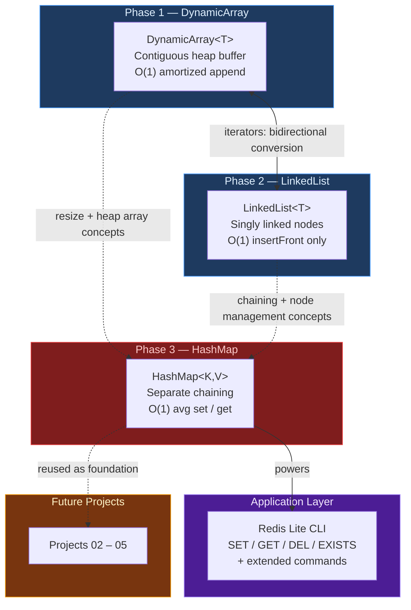

# SuperCoders Project 01 — Collections Library
## Design Proposal (Phase 0)

> Build a reusable, generic **C++ Collections Library** from scratch — without using any STL containers (`std::vector`, `std::map`, `std::list`, etc.).

---

## Objective

This library implements three core data structures and one real-world application built on top of them:

| Component | What It Is | Analogous To |
|---|---|---|
| `DynamicArray<T>` | Growable contiguous array | `std::vector` |
| `LinkedList<T>` | Singly linked list with forward-only traversal | `std::forward_list` |
| `HashMap<K, V>` | Hash table with separate chaining | `std::unordered_map` |
| **Redis Lite** | In-memory key-value CLI store | Redis |

---

## Core Goals

- **Manual memory management** — every `new` / `malloc` is paired with exactly one `delete` / `free`. No smart pointers, no garbage collection.
- **Generics (templates)** — all three structures are type-independent. Write once, use with any type.
- **Rule of Five** — every class implements destructor, copy constructor, copy assignment, move constructor, and move assignment to prevent leaks and crashes.
- **Iterator support** — DynamicArray and LinkedList expose iterators enabling range-based `for` loops and bidirectional cross-structure conversion via compile-time duck typing.
- **Valgrind-clean** — zero memory leaks, zero invalid reads/writes.

---

## Constraints

- No STL containers in the implementation.
- `std::string` and `std::cout` are allowed for I/O.
- Permitted headers: `<stdexcept>`, `<cstdlib>`, `<new>`, `<utility>`, `<type_traits>`, `<cstddef>`, `<iterator>`.

---

## Document Index

| Document | Description |
|---|---|
| [dynamic_array.md](./dynamic_array.md) | Design proposal for `DynamicArray<T>` |
| [linked_list.md](./linked_list.md) | Design proposal for `LinkedList<T>` |
| [hashmap.md](./hashmap.md) | Design proposal for `HashMap<K, V>` |
| [redis_lite.md](./redis_lite.md) | Design proposal for Redis Lite CLI |

---

## Architecture Overview



---

## Complexity Summary

### DynamicArray&lt;T&gt;

| Operation | Best | Average | Worst | Notes |
|---|---|---|---|---|
| `append(value)` | O(1) | **O(1) amortized** | O(n) | Resize is rare — see amortized proof below |
| `get(i)` | O(1) | O(1) | O(1) | Direct pointer arithmetic |
| `insert(i, value)` | O(1) | O(n) | O(n) | Elements shift right |
| `remove(i)` | O(1) | O(n) | O(n) | Elements shift left |
| `popBack()` | O(1) | O(1) | O(1) | Decrement size only |
| `contains()` / `indexOf()` | O(1) | O(n) | O(n) | Linear scan |
| Move constructor | O(1) | O(1) | O(1) | Steal pointer, no copying |
| Copy constructor | O(n) | O(n) | O(n) | Full element copy |

> **Why `append` is O(1) amortized:** Doubling the capacity means resizes happen at sizes 4, 8, 16, 32 … i.e., log₂(N) total resizes over N appends. The total copy work across all resizes is 1 + 2 + 4 + … + N/2 = N − 1 copies. Spread over N appends that is ≈ 1 extra copy per append → **O(1) amortized**.

### LinkedList&lt;T&gt;

| Operation | Best | Average | Worst | Notes |
|---|---|---|---|---|
| `insertFront()` | O(1) | O(1) | O(1) | New node becomes head — no traversal |
| `insertBack()` | O(n) | O(n) | O(n) | No tail pointer — must walk to last node |
| `deleteFront()` | O(1) | O(1) | O(1) | Move head forward, delete old head |
| `deleteBack()` | O(n) | O(n) | O(n) | No prev pointer — must find second-to-last |
| `insert(i)` / `remove(i)` | O(1) | O(n) | O(n) | Best: index 0. Otherwise traverse i steps |
| `search(val)` / `get(i)` | O(1) | O(n) | O(n) | Best: at head. No random access |
| Move constructor | O(1) | O(1) | O(1) | Steal head pointer — no node copying |

### HashMap&lt;K, V&gt;

| Operation | Best | Average | Worst | Notes |
|---|---|---|---|---|
| `set()` / `get()` / `exists()` / `remove()` | O(1) | **O(1)** | O(n) | Worst: all keys collide into one chain |
| `rehash()` | O(n) | O(n) | O(n) | Every entry re-inserted |
| `size()` / `loadFactor()` | O(1) | O(1) | O(1) | Stored member variables |
| Move constructor | O(1) | O(1) | O(1) | Steal buckets pointer |

> **Why `set` / `get` is O(1) amortized:** The load factor threshold (0.7) keeps chains short on average. When load exceeds 0.7, a full rehash doubles the bucket count — rare, like DynamicArray's resize. The O(n) rehash cost spread across the many O(1) inserts that preceded it averages out to O(1) per insertion. HashMap's internal chains are singly linked — only head operations are needed, so no doubly linked overhead.

---

## File Organization

```
project01/
├── include/
│   ├── DynamicArray.h       ← template class (header-only)
│   ├── LinkedList.h         ← template class (header-only)
│   └── HashMap.h            ← template class (header-only)
├── src/
│   ├── main.cpp
│   └── RedisCLI.cpp
├── tests/
│   ├── test_dynamic_array.cpp
│   ├── test_linked_list.cpp
│   └── test_hashmap.cpp
├── docs/
│   ├── README.md            ← you are here (proposal overview)
│   ├── dynamic_array.md     ← DynamicArray proposal
│   ├── linked_list.md       ← LinkedList proposal
│   ├── hashmap.md           ← HashMap proposal
│   └── redis_lite.md        ← Redis Lite proposal
├── journals/
│   └── ...                  ← daily build journals (Phase 1+)
├── Makefile
└── .gitignore
```

> **Note on templates:** Since all three structures are template classes, their full implementation must live in the `.h` header file. The compiler must see the full template code to instantiate the correct version for each type used.

---

## Build System Plan

| Target | Description |
|---|---|
| `make all` | Compile the main program |
| `make test` | Compile and run all test files |
| `make valgrind` | Run under Valgrind memory checker |
| `make clean` | Remove all build artifacts |

**Compiler flags planned:** `-std=c++17 -g -Wall -Wextra -Werror`
