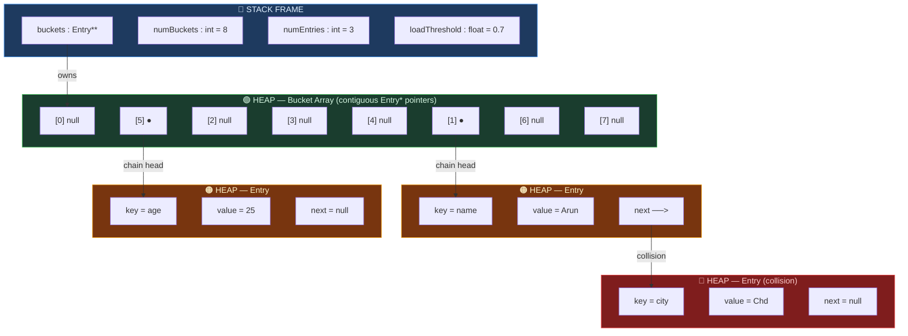
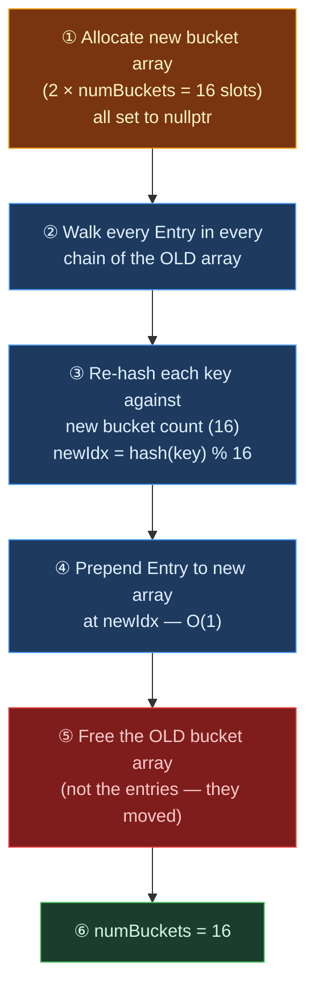
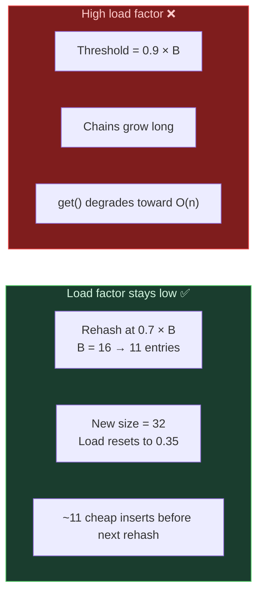
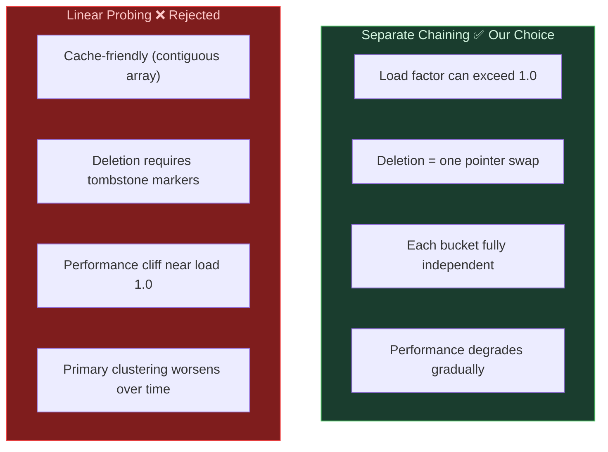
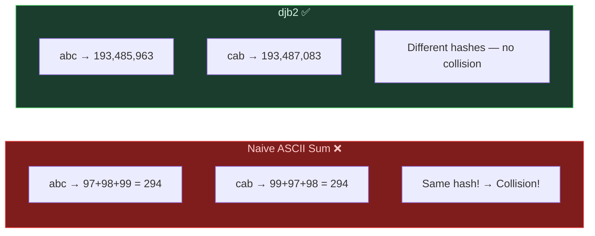

# Design Proposal: HashMap&lt;K, V&gt;

> **What is it?** A key-value storage system that uses a mathematical hash function to convert any key into an exact array index, providing near-instant O(1) lookups on average. Collisions — when two different keys land on the same index — are handled by building a small linked chain at that bucket.

---

## Section 1 — Public API

### Lifecycle Management (Rule of Three)

| Member | Purpose |
|---|---|
| `HashMap()` | Default constructor — 16 buckets, load threshold 0.7 |
| `~HashMap()` | Walks every bucket chain and deletes every Entry node, then frees the bucket array |
| `HashMap(const HashMap&)` | Deep copy — new bucket array, all chains duplicated |
| `operator=(const HashMap&)` | Deep copy assignment — purge self, deep copy source |

> **Why Rule of Three instead of Five?** HashMap does not benefit from move semantics as naturally as DynamicArray because its internal bucket array is a pointer-to-pointers; move is possible but Rule of Three covers all correctness requirements for Phase 0.

### Core Operations

| Function | Signature | Description |
|---|---|---|
| `set` | `void set(std::string key, std::string value)` | Insert or overwrite. Triggers rehash if load factor exceeds threshold |
| `get` | `std::string get(std::string key) const` | Returns value for key, or `""` (empty string) if key not found |
| `exists` | `bool exists(std::string key) const` | Returns `true` if the key is present |
| `remove` | `void remove(std::string key)` | Unlinks and deletes the matching Entry node from its chain |
| `clear` | `void clear()` | Deletes all Entry nodes across all chains; resets count to 0 |

### Sizing & Metrics

| Function | Signature | Description |
|---|---|---|
| `size` | `int size() const` | Returns number of stored key-value pairs (not bucket count) |
| `bucketCount` | `int bucketCount() const` | Returns current number of buckets |
| `loadFactor` | `float loadFactor() const` | Returns `numEntries / numBuckets` |

### Debug Utility

| Function | Signature | Description |
|---|---|---|
| `print` | `void print() const` | Dumps all buckets and chains to stdout for debugging |

---

## Section 2 — Internal Structure

### Entry Node

Each stored key-value pair is wrapped in an `Entry` node:

```
Entry {
    key    : std::string   ← the key
    value  : std::string   ← the stored value
    next   : Entry*        ← pointer to next entry in the same bucket chain
}
```

### Bucket Array

The HashMap owns a heap-allocated array of `Entry*` pointers. Each pointer is either `nullptr` (empty bucket) or the head of a chain of `Entry` nodes:

```
buckets[0] → nullptr
buckets[1] → Entry{"name","Arun"} → Entry{"city","Chd"} → nullptr
buckets[2] → nullptr
...
buckets[5] → Entry{"age","25"} → nullptr
```

---

## Section 3 — Memory Layout

### Full Structure Diagram



- **Stack (blue):** `buckets` pointer, `numBuckets`, `numEntries`, and `loadThreshold` live on the stack.
- **Heap — Bucket Array (green):** A contiguous array of `Entry*` pointers, all initialised to `nullptr`.
- **Heap — Entry nodes (orange):** Each `Entry` lives at an independent heap address.
- **Collision (red):** When "name" and "city" both hash to bucket [1], they form a chain. The red entry follows the orange one via `next`.

### Rehash Procedure



> **Critical:** Entries cannot be moved to the same bucket index after a rehash. `key % oldSize ≠ key % newSize` in general. Every entry must be **re-hashed** against the new bucket count.

---

## Section 4 — Complexity Estimates

| Operation | Best | Average | Worst | Explanation |
|---|---|---|---|---|
| `set(key, value)` | O(1) | **O(1) amortized** | O(n) | Hash gives bucket in O(1). Overwrite or prepend to chain. O(n) only when all n keys hash to the same bucket. Rehash is O(n) but rare — see amortized proof |
| `get(key)` | O(1) | O(1) | O(n) | Same logic: hash → bucket → walk chain. O(1) when chain is short |
| `exists(key)` | O(1) | O(1) | O(n) | Same as `get()` but returns bool |
| `remove(key)` | O(1) | O(1) | O(n) | Hash → bucket → find → unlink → delete |
| `rehash()` | O(n) | O(n) | O(n) | Must visit every stored entry and re-hash it — always O(n) |
| `size()` / `loadFactor()` | O(1) | O(1) | O(1) | Returns stored member variables |
| `clear()` | O(n) | O(n) | O(n) | Must delete every Entry node in every chain |
| Move constructor | O(1) | O(1) | O(1) | Steal `buckets` pointer, `numBuckets`, `numEntries` |
| Copy constructor | O(n) | O(n) | O(n) | Allocate new bucket array, `set()` every entry from source |

### Amortized O(1) for `set`

The same doubling argument as DynamicArray applies here:

- Rehash triggers when `loadFactor > 0.7`, i.e., when `numEntries > 0.7 × numBuckets`.
- After rehash, the table has 2× buckets and ≈ 0.35 load factor — far from the threshold.
- Between two consecutive rehashes at sizes B and 2B, there are ≈ 0.7B cheap O(1) insertions.
- Rehash cost is O(n). Spread across those 0.7B insertions → **≈ 1 extra op per insertion → O(1) amortized**.



---

## Section 5 — Design Decisions

### Core Decisions

| Decision | Our Choice | What We Rejected | Reason |
|---|---|---|---|
| **Collision strategy** | Separate chaining (linked Entry nodes) | Linear probing (scan next slots) | Probing needs tombstone markers for deletion — complex and error-prone. Chaining makes deletion simple (pointer unlink). Chaining allows load factor > 1.0 and degrades gradually. |
| **Hash function** | djb2 (`hash = hash × 33 + c`) | ASCII character sum | ASCII sum gives the same hash for anagrams — "abc" and "cab" both sum to 294. djb2 is position-sensitive (multiply-and-add) so anagrams produce different hashes. |
| **Initial bucket count** | 16 | 8 (fills too fast), 32 (wasteful for small maps) | Power of 2. Holds 11 entries before 0.7 threshold triggers rehash. |
| **Load threshold** | 0.7 | 0.5 (rehash too often, wastes time), 0.9 (chains grow long, degrades lookup) | Industry standard — same value used by Java's `HashMap`. Balances chain length vs. rehash frequency. |
| **Rehash growth factor** | × 2 | Fixed step | Mirrors DynamicArray's doubling. Logarithmic rehash count over the object's lifetime → amortized O(1) per `set`. |
| **Missing key in `get()`** | Return `""` (empty string) | Throw exception | Missing key is a normal lookup result in Redis-style usage, not a programming error. Avoids mandatory try-catch at every call site. |

### Collision Strategies Compared



### Hash Function Comparison



**djb2 algorithm:**
```
hash = 5381
for each character c in key:
    hash = hash × 33 + c
return hash
```

The multiply-by-33 step makes the hash position-sensitive: character `c` at position `i` contributes differently from the same `c` at position `j`. This breaks the anagram collision problem of naive summation.

**Why not a cryptographic hash (SHA-256, MD5)?** Hash tables need *speed* and *even distribution*, not cryptographic collision resistance. djb2 runs in nanoseconds; SHA-256 is hundreds of times slower.

---

## Section 6 — C++ Tools Planned

| Tool | Header | Why We Need It |
|---|---|---|
| `new` / `delete` | built-in | Allocate individual `Entry` nodes and the `Entry*` bucket array |
| `std::string` comparison (`==`) | `<string>` | Compare keys during chain traversal for collision resolution |
| `std::out_of_range` | `<stdexcept>` | Optional: throw if `get()` is switched to exception-based error handling |
| `std::move` | `<utility>` | Move constructor and assignment (if implemented beyond Rule of Three) |
