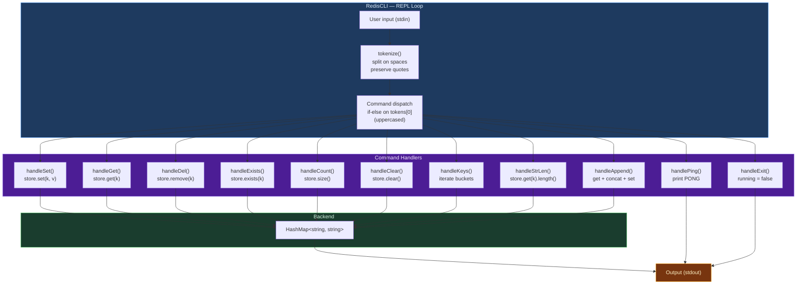

# Design Proposal: Redis Lite

> **What is it?** A lightweight command-line key-value store built directly on top of our custom `HashMap<std::string, std::string>`. It demonstrates how a fundamental data structure can power a real-world in-memory database system, mirroring the core interface of the real Redis.

---

## Section 1 — Overview

Redis Lite is a **REPL (Read-Eval-Print Loop)** application. The user types commands, the REPL parses them, dispatches them to the `HashMap` backend, and prints results — continuously, until `EXIT` is entered.

```
redis-lite> SET name Arun
OK
redis-lite> GET name
"Arun"
redis-lite> EXISTS name
(true)
redis-lite> COUNT
(integer) 1
redis-lite> EXIT
Bye!
```

---

## Section 2 — Planned API

### Core Loop & Lifecycle

| Method | Description |
|---|---|
| `RedisCLI()` | Constructor — binds the REPL to a `HashMap<string, string>` instance |
| `run()` | Launches the main REPL loop: read → tokenize → dispatch → print |
| `handleExit()` | Sets `running = false`, triggering graceful shutdown and destructor cleanup |

> **Why `bool running` instead of `std::exit(0)`?** Calling `std::exit(0)` skips all destructors — our HashMap would leak every stored Entry node. A flag lets the loop exit naturally, running all destructors and freeing all memory.

### Standard Redis Commands

| Command | Method | Arguments | Returns | Description |
|---|---|---|---|---|
| `SET` | `handleSet` | `key value` | `OK` | Insert or overwrite a key-value pair |
| `GET` | `handleGet` | `key` | `"value"` or `(nil)` | Retrieve value for key |
| `DEL` | `handleDel` | `key` | `(1)` or `(0)` | Delete a key-value pair |
| `EXISTS` | `handleExists` | `key` | `(true)` or `(false)` | Check if key is present |
| `COUNT` | `handleCount` | — | `(integer) N` | Number of stored pairs |
| `CLEAR` | `handleClear` | — | `OK` | Delete all stored pairs |

### Extended Commands

| Command | Method | Arguments | Returns | Description |
|---|---|---|---|---|
| `PING` | `handlePing` | — | `PONG` | Verify the REPL is alive and responsive |
| `KEYS` | `handleKeys` | — | List of keys | Print all currently stored keys |
| `STRLEN` | `handleStrLen` | `key` | `(integer) N` | Character length of the value for `key` |
| `APPEND` | `handleAppend` | `key suffix` | `OK` | Concatenate `suffix` onto the existing value |

### Parsing Utilities

| Method | Description |
|---|---|
| `tokenize(input)` | Splits input string on spaces while preserving `"quoted strings"` as one token |
| `printHelp()` | Prints a formatted list of all commands, arguments, and usage when input is invalid |

---

## Section 3 — Architecture



---

## Section 4 — Command Reference

### Full Command Specification

| Command | Arguments | Returns on success | Returns on missing key | Notes |
|---|---|---|---|---|
| `SET key value` | key, value | `OK` | — | Overwrites if key exists |
| `GET key` | key | `"value"` | `(nil)` | |
| `DEL key` | key | `(1)` | `(0)` | |
| `EXISTS key` | key | `(true)` | `(false)` | |
| `COUNT` | none | `(integer) N` | — | |
| `CLEAR` | none | `OK` | — | Empties entire store |
| `PING` | none | `PONG` | — | |
| `KEYS` | none | Key list or `(empty)` | — | |
| `STRLEN key` | key | `(integer) N` | `(0)` | Length of value string |
| `APPEND key suffix` | key, suffix | `OK` | Creates key with suffix | |
| `EXIT` | none | `Bye!` | — | Graceful shutdown |

### Session Example

```
redis-lite> PING
PONG

redis-lite> SET name Arun
OK
redis-lite> SET city Chandigarh
OK
redis-lite> SET age 21
OK

redis-lite> GET name
"Arun"
redis-lite> GET country
(nil)

redis-lite> EXISTS city
(true)
redis-lite> EXISTS country
(false)

redis-lite> COUNT
(integer) 3

redis-lite> KEYS
1) "name"
2) "city"
3) "age"

redis-lite> STRLEN name
(integer) 4

redis-lite> APPEND name " Singh"
OK
redis-lite> GET name
"Arun Singh"

redis-lite> DEL age
(1)
redis-lite> COUNT
(integer) 2

redis-lite> CLEAR
OK
redis-lite> COUNT
(integer) 0

redis-lite> EXIT
Bye!
```

---

## Section 5 — Design Decisions

| Decision | Our Choice | What We Rejected | Reason |
|---|---|---|---|
| **Underlying store** | `HashMap<string, string>` (our own) | `std::unordered_map` | The purpose of the project is to use our own data structures, not STL containers |
| **Missing key in `GET`** | Return `(nil)` | Throw exception | Missing key is a normal query result, not a programming error. Exceptions force try-catch at every call site |
| **Input parsing** | Custom `tokenize()` with quote state machine | `std::stringstream` split on spaces | Simple space-split breaks values with spaces. `SET name "Arun Singh"` would give 4 tokens, splitting the value. Quote preservation handles multi-word strings correctly |
| **Shutdown** | `bool running = false` | `std::exit(0)` | `exit()` skips destructors — HashMap leaks all entry memory. Flag lets the REPL exit cleanly |
| **Command dispatch** | `if-else` chain on uppercased token | `std::map<string, function>` | Simpler code, easier to debug. With ≈ 11 commands, linear dispatch is negligible overhead |
| **Case sensitivity** | Case-insensitive (convert to upper before dispatch) | Exact-case only | Real Redis is case-insensitive for commands. Improves usability without any cost |

---

## Section 6 — Connection to HashMap

Redis Lite is entirely powered by our `HashMap<std::string, std::string>`. The mapping from Redis command to HashMap operation is direct:

| Redis Command | HashMap Method |
|---|---|
| `SET key value` | `store.set(key, value)` |
| `GET key` | `store.get(key)` |
| `DEL key` | `store.remove(key)` |
| `EXISTS key` | `store.exists(key)` |
| `COUNT` | `store.size()` |
| `CLEAR` | `store.clear()` |
| `KEYS` | Iterate `store.buckets[]` |
| `STRLEN key` | `store.get(key).length()` |
| `APPEND key s` | `store.set(key, store.get(key) + s)` |

This demonstrates the core principle: **a well-designed data structure becomes the foundation for real-world applications with almost no extra logic.**
